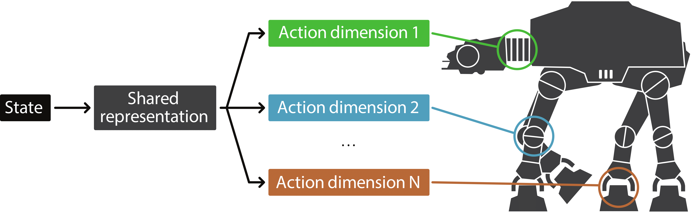
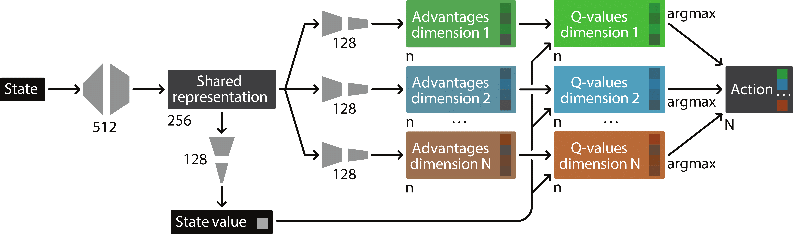
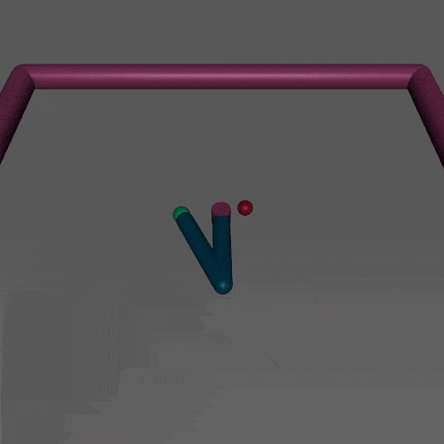

# Action Branching Agents


Action Branching Agents repository provides a set of deep reinforcement learning agents based on the incorporation of the [action branching architecture](https://arxiv.org/abs/1711.08946) into the existing reinforcement learning algorithms. 

<p align="center">
  
</p>


## Motivation 

Discrete-action algorithms have been central to numerous recent successes of deep reinforcement learning. However, applying these algorithms to high-dimensional action tasks requires tackling the combinatorial increase of the number of possible actions with the number of action dimensions. This problem is further exacerbated for continuous-action tasks that require fine control of actions via discretization. To address this problem, we propose the action branching architecture, a novel neural architecture featuring a shared network module followed by several network branches, one for each action dimension. This approach achieves a linear increase of the number of network outputs with the number of degrees of freedom by allowing a level of independence for each individual action dimension.
 

## Supported Agents

* Branching Dueling Q-Network (BDQ) ([code](agents/bdq), [paper](https://arxiv.org/abs/1711.08946))

<p align="center">
  
</p>

Branching Dueling Q-Network (BDQ) is a novel agent which is based on the incorporation of the proposed [action branching architecture](https://arxiv.org/abs/1711.08946) into the [Deep Q-Network (DQN)](https://www.nature.com/articles/nature14236) algorithm, as well as adapting a selection of its extensions, [Double Q-Learning](https://arxiv.org/abs/1509.06461), [Dueling Network Architectures](https://arxiv.org/abs/1511.06581), and [Prioritized Experience Replay](https://arxiv.org/abs/1511.05952). 

As we show in the [paper](https://arxiv.org/abs/1711.08946), BDQ is able to solve numerous continuous control domains via discretization of the action space. Most remarkably, we have shown that BDQ is able to perform well on the Humanoid-v1 domain with a total of 6.5 x 10<sup>25</sup> discrete actions.     

<p align="center">
  
 
<br>
 
 
 

</p>


## Getting Started

You can clone this repository by:

```bash
git clone https://github.com/atavakol/action-branching-agents.git
``` 


### Train 

You can readily train a new model for any continuous control domain compatible with the OpenAI Gym by running the [train_continuous.py](./agents/bdq/train_continuous.py) script from the agent's main directory. 


### Evaluate 

Alternatively, you can evaluate a pre-trained model included in the agent's ```trained_models``` directory, by running the [enjoy_continuous.py](./agents/bdq/enjoy_continuous.py) script from the agent's main directory.


## Citation

If you find this open-source release useful, please reference in your paper:

```
@inproceedings{tavakoli2018action,
  title={Action Branching Architectures for Deep Reinforcement Learning},
  author={Tavakoli, Arash and Pardo, Fabio and Kormushev, Petar},
  booktitle={AAAI Conference on Artificial Intelligence},
  pages={4131--4138},
  year={2018}
}
```